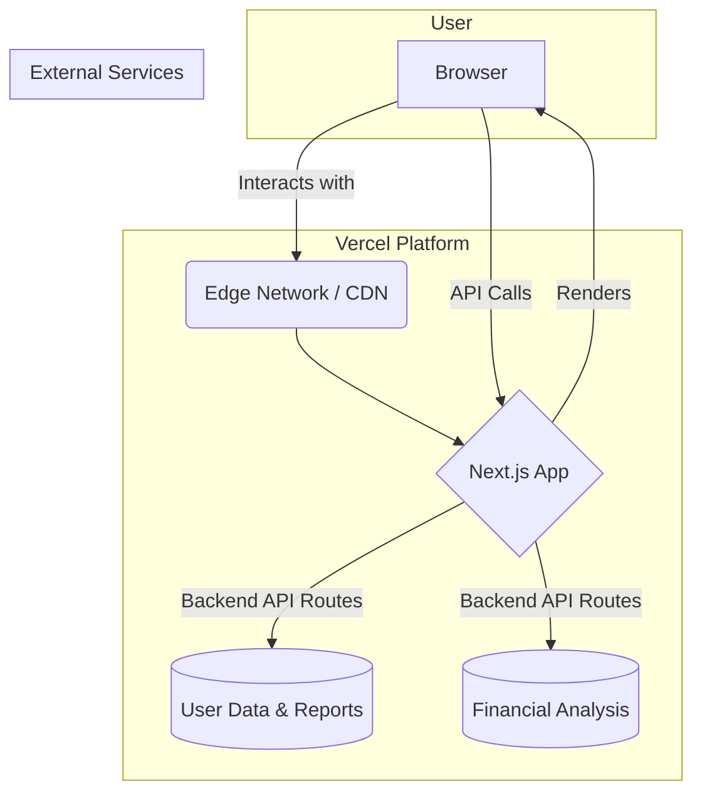
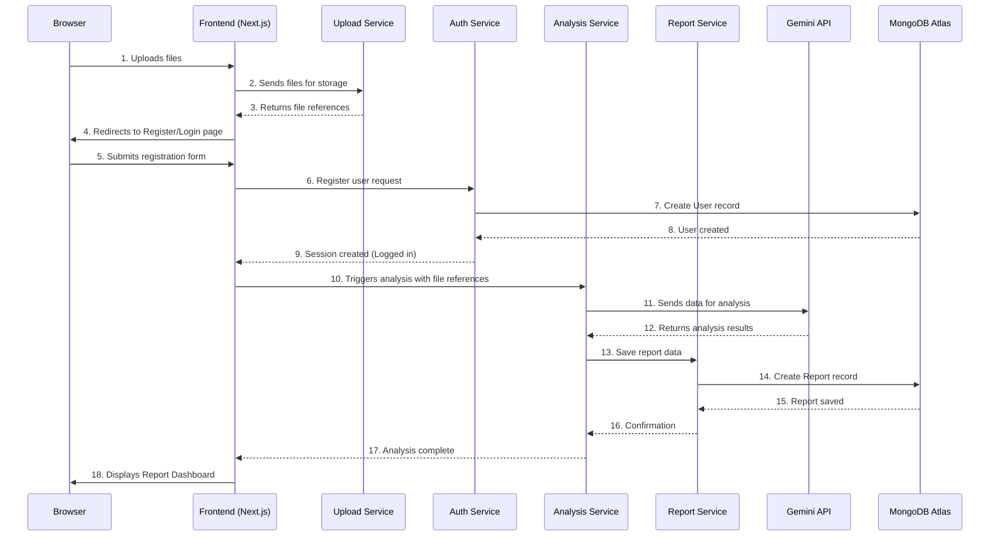
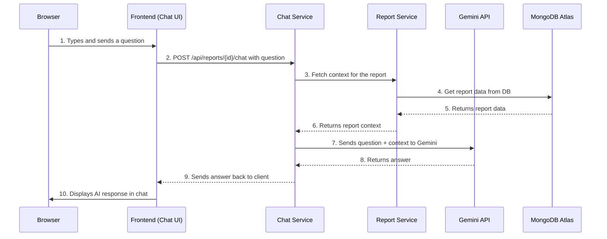
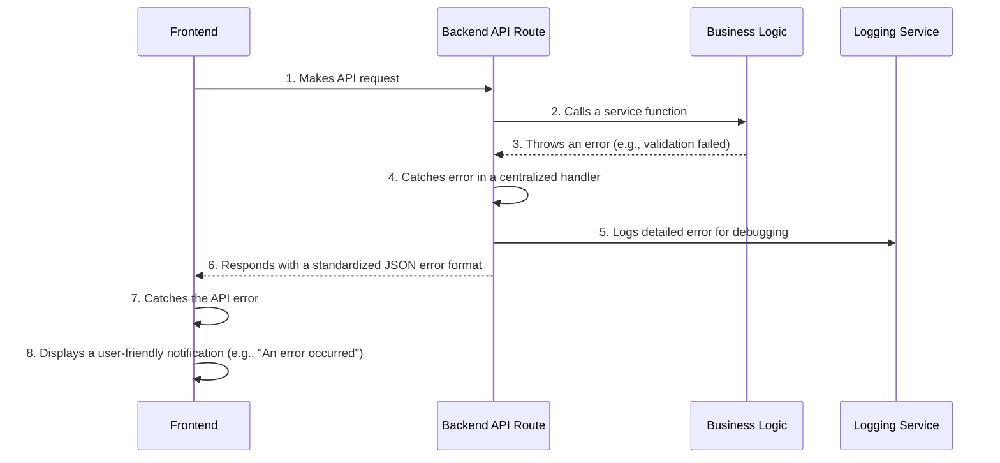

As John, the Product Manager, my work on the Product Requirements Document is now complete. It provides a solid foundation for the next phase of our project. I am now handing off to the orchestrator.

### **1. Introduction**

[cite_start]This document outlines the complete fullstack architecture for the Bank Statement Analyzer, including backend systems, frontend implementation, and their integration[cite: 880]. [cite_start]It serves as the single source of truth for AI-driven development, ensuring consistency across the entire technology stack[cite: 881]. [cite_start]This unified approach will streamline the development process for this modern fullstack application[cite: 882].

#### **Starter Template or Existing Project**

Based on the PRD's technical assumptions, this greenfield project will be built using the **Next.js framework**. Next.js acts as our starter template, providing a pre-configured, production-ready environment for both the frontend (React) and the serverless backend (API Routes). [cite_start]This choice significantly accelerates setup and ensures we adhere to Vercel's best practices from the start[cite: 838, 842].

#### **Change Log**

| Date | Version | Description | Author |
| :--- | :--- | :--- | :--- |
| 2025-08-03 | 1.0 | Initial Architecture Draft | Winston (Architect) |

***

This introduction sets the stage for our technical design.


### **2. High Level Architecture**

#### **Technical Summary**

This project will be a serverless, full-stack application built with **Next.js** and deployed on the **Vercel** platform. The system features a modern React frontend and a backend composed of serverless API routes, which will handle user authentication, data storage in **MongoDB Atlas**, and integration with the **Gemini AI model** for core analysis. This architecture is designed for high performance, automatic scalability, and a streamlined developer experience, directly supporting the PRD's goals of creating a responsive and powerful user-facing tool.

#### **Platform and Infrastructure Choice**

  * **Platform:** **Vercel**. This is the native platform for Next.js, providing an optimized, all-in-one solution for build, deployment, and hosting.
  * **Key Services:**
      * **Vercel:** Hosting, Edge CDN, and Serverless Functions for the backend API.
      * **MongoDB Atlas:** Our primary database-as-a-service for storing user data and analysis history.
      * **Google Cloud:** To host and interact with the Gemini AI model.
  * **Deployment Host and Regions:** Managed by Vercel's global edge network to ensure low latency for users worldwide.

#### **Repository Structure**

  * **Structure:** **Monorepo**. This was determined in the PRD.
  * **Monorepo Tool:** **Turborepo**. We will use Turborepo to manage the monorepo. It provides intelligent build caching and task orchestration, which is highly optimized for Vercel deployments and significantly speeds up build times.
  * **Package Organization:** We will use a standard `apps` and `packages` structure to separate the main web application from shared code (e.g., UI components, configs).

#### **High Level Architecture Diagram**



#### **Architectural Patterns**

  * **Serverless Architecture:** We will use Vercel Functions for all backend logic.
      * *Rationale:* This eliminates server management, scales automatically, and is the most cost-effective and performant approach for the Vercel platform.
  * **Component-Based UI:** The frontend will be built as a collection of reusable React components.
      * *Rationale:* This is the standard for modern web development, promoting maintainability, reusability, and testability.
  * **API Gateway (Implicit):** The Next.js API routes will serve as a single, unified gateway for all frontend requests to the backend.
      * *Rationale:* This simplifies the frontend code, centralizes backend concerns like authentication and data fetching, and provides a clear contract between the client and server.
  * **Repository Pattern (Backend):** We will use the repository pattern to abstract all database operations. Business logic will not interact directly with the MongoDB driver.
      * *Rationale:* This decouples our business logic from the database, which makes the code significantly easier to test, maintain, and potentially migrate in the future.

Excellent. Let's proceed.

We will now define the definitive **Tech Stack** for the project. This table is the single source of truth for all technologies, libraries, and tools to be used by the development team. All choices are based on our previous discussions and are optimized for our chosen full-stack, serverless architecture on Vercel.

***

### **3. Tech Stack**

#### **Technology Stack Table**

| Category | Technology | Version | Purpose | Rationale |
| :--- | :--- | :--- | :--- | :--- |
| **Frontend Language** | TypeScript | ~5.4 | Language for frontend code | [cite_start]Provides type safety and scalability for a large codebase. [cite: 910] |
| **Frontend Framework** | Next.js (React) | ~14.2 | Core application framework | [cite_start]The premier framework for Vercel, offering a seamless full-stack experience. [cite: 910] |
| **UI Component Library** | Shadcn/ui | n/a | Building blocks for the UI | A modern, accessible, and composable set of components that we can own and customize. |
| **State Management** | Zustand | ~4.5 | For managing complex client-side state | [cite_start]Minimal, fast, and scalable state management solution with very little boilerplate. [cite: 910] |
| **Backend Language** | TypeScript | ~5.4 | Language for backend API code | [cite_start]Ensures type safety and allows code/type sharing with the frontend. [cite: 910] |
| **Backend Framework** | Next.js API Routes | ~14.2 | For building the serverless backend | [cite_start]Natively integrated into our framework and deployment platform (Vercel). [cite: 910] |
| **Database** | MongoDB Atlas | n/a | Primary data store for users and reports | [cite_start]A scalable, document-based database that aligns with our serverless approach. [cite: 910] |
| **Database ODM** | Mongoose | ~8.4 | Object Data Modeling for MongoDB | Provides a robust schema definition and validation layer for our database. |
| **File Storage** | Vercel Blob | n/a | Storing user-uploaded statement files | [cite_start]Natively integrated with Vercel for simple, secure, and cost-effective file storage. [cite: 911] |
| **Authentication** | NextAuth.js (v4) | ~4.24 | Handles user sign-up, login, sessions | [cite_start]The industry standard for Next.js, providing a secure and extensible authentication system. [cite: 911] |
| **Testing (Unit/Component)** | Jest & React Testing Library | ~29.7 | For testing components and functions | [cite_start]Industry standard for the React ecosystem, providing a comprehensive testing toolkit. [cite: 911] |
| **Testing (E2E)** | Playwright | ~1.44 | For end-to-end user flow testing | [cite_start]A modern and powerful tool for reliable cross-browser testing of the full application. [cite: 911] |
| **CI/CD** | Vercel CI/CD | n/a | Continuous integration & deployment | [cite_start]Zero-configuration, Git-integrated pipeline optimized for Next.js and Turborepo. [cite: 912] |
| **Monitoring** | Vercel Analytics & Sentry | n/a | Performance monitoring & error tracking | [cite_start]Vercel provides real-time performance data, while Sentry offers in-depth error diagnostics. [cite: 912] |
| **Styling** | Tailwind CSS | ~3.4 | CSS framework | [cite_start]A utility-first framework that allows for rapid UI development and easy customization. [cite: 912] |

***

Of course. Let's proceed to define the data structures that will underpin the application.

This section outlines the core **Data Models**. These definitions will serve as the blueprint for both our database schema and the shared TypeScript types used across the frontend and backend, ensuring data consistency throughout the system.

-----

### **4. Data Models**

#### **User**

  * **Purpose:** Represents an authenticated user in the system. This model is essential for managing accounts, authentication, and ownership of financial data.
  * **Key Attributes:**
      * `name`: String - The user's display name.
      * `email`: String - The user's unique login email address (indexed).
      * `password`: String - The securely hashed password.
      * `createdAt`, `updatedAt`: Date - Timestamps for record management.
  * **TypeScript Interface:**
    ```typescript
    interface User {
      _id: string;
      name: string;
      email: string;
      createdAt: Date;
      updatedAt: Date;
    }
    ```
  * **Relationships:**
      * A `User` has many `AnalysisReports`.

-----

#### **AnalysisReport**

  * **Purpose:** Stores the results of a financial analysis generated by the Gemini model, linking a user to their specific insights.
  * **Key Attributes:**
      * `userId`: ObjectId - A reference to the owning `User`.
      * `reportTitle`: String - A user-friendly title (e.g., "Analysis for July 2025").
      * `sourceDocumentCount`: Number - The number of files used for this analysis.
      * `generatedData`: Object - The structured JSON output from the Gemini analysis (income, expenses, categories, projections, etc.).
      * `createdAt`: Date - Timestamp when the report was created.
  * **TypeScript Interface:**
    ```typescript
    interface AnalysisReport {
      _id: string;
      userId: string;
      reportTitle: string;
      sourceDocumentCount: number;
      generatedData: {
        totalIncome: number;
        totalExpenses: number;
        // ... other structured analysis data
      };
      createdAt: Date;
    }
    ```
  * **Relationships:**
      * An `AnalysisReport` belongs to one `User`.

Of course. Having defined our data, we will now define the contract for how our frontend and backend will communicate. This is the **API Specification**.

Based on our decision to use Next.js API Routes, we will be building a REST API. The best practice for defining a REST API is to use the **OpenAPI 3.0 standard**. I have created a foundational specification in YAML format that outlines the key endpoints required to fulfill the user stories in our PRD.

-----

### **5. API Specification**

This specification describes the REST API for the Bank Statement Analyzer. It provides a clear contract for all client-server communication.

#### **REST API Specification (OpenAPI 3.0)**

```yaml
openapi: 3.0.0
info:
  title: Bank Statement Analyzer API
  version: 1.0.0
  description: API for analyzing financial documents, managing user accounts, and providing AI-powered insights.

servers:
  - url: /api
    description: Local development server

paths:
  /auth/register:
    post:
      summary: Register a new user
      requestBody:
        required: true
        content:
          application/json:
            schema:
              type: object
              properties:
                name:
                  type: string
                email:
                  type: string
                password:
                  type: string
      responses:
        '201':
          description: User created successfully

  /auth/login:
    post:
      summary: Log in a user
      requestBody:
        required: true
        content:
          application/json:
            schema:
              type: object
              properties:
                email:
                  type: string
                password:
                  type: string
      responses:
        '200':
          description: Login successful

  /reports:
    get:
      summary: Get all analysis reports for the current user
      responses:
        '200':
          description: A list of reports
          content:
            application/json:
              schema:
                type: array
                items:
                  $ref: '#/components/schemas/AnalysisReport'
    post:
      summary: Initiate a new analysis
      description: This endpoint would be triggered after file uploads are complete.
      responses:
        '202':
          description: Analysis started, returns the new report object.

  /reports/{reportId}:
    get:
      summary: Get a specific analysis report by ID
      parameters:
        - name: reportId
          in: path
          required: true
          schema:
            type: string
      responses:
        '200':
          description: A single analysis report
          content:
            application/json:
              schema:
                $ref: '#/components/schemas/AnalysisReport'

  /reports/{reportId}/chat:
    post:
      summary: Post a message to the AI co-pilot for a specific report
      parameters:
        - name: reportId
          in: path
          required: true
          schema:
            type: string
      requestBody:
        required: true
        content:
          application/json:
            schema:
              type: object
              properties:
                message:
                  type: string
      responses:
        '200':
          description: The AI's response message

components:
  schemas:
    AnalysisReport:
      type: object
      properties:
        _id:
          type: string
        userId:
          type: string
        reportTitle:
          type: string
        sourceDocumentCount:
          type: number
        generatedData:
          type: object
        createdAt:
          type: string
          format: date-time
```

Of course. Having defined the data and the API contract, we will now break down the application into its major logical **Components**.

This section describes the high-level building blocks of our system, covering both the frontend and backend. Each component has a distinct responsibility, which helps in organizing the development work.

-----

### **6. Components**

#### **Frontend Components**

  * **Auth UI Component**

      * **Responsibility:** Provides the user interface for registration and login.
      * **Key Interfaces:** Renders on the `/login` route; captures user credentials.
      * **Dependencies:** `Auth Service` on the backend.
      * **Technology Stack:** Next.js, React, Shadcn/ui, Tailwind CSS.

  * **File Upload Component**

      * **Responsibility:** Handles the user-facing file upload experience, including drag-and-drop, file selection, and paste.
      * **Key Interfaces:** Renders on the homepage; sends files to the `Upload Service`.
      * **Dependencies:** `Upload Service` on the backend.
      * **Technology Stack:** React, a library like `react-dropzone`.

  * **Report Dashboard Component**

      * **Responsibility:** Renders the complete financial analysis report, including charts and data visualizations.
      * **Key Interfaces:** The main view for a generated report; displays data fetched from the `Report Service`.
      * **Dependencies:** `Report Service`, `Chat Component`.
      * **Technology Stack:** React, a charting library (e.g., Recharts), Shadcn/ui.

  * **Chat Component**

      * **Responsibility:** Manages the interactive conversation with the AI co-pilot.
      * **Key Interfaces:** Renders on the Report Dashboard; sends user messages to the `Chat Service`.
      * **Dependencies:** `Chat Service`.
      * **Technology Stack:** React, Zustand (for state management).

#### **Backend Components (Services)**

  * **Auth Service**

      * **Responsibility:** Manages all user authentication logic, including registration, login, session management, and password hashing.
      * **Key Interfaces:** Exposes the `/api/auth/*` endpoints.
      * **Dependencies:** `MongoDB Atlas` (for user data).
      * **Technology Stack:** Next.js API Route, Mongoose, NextAuth.js.

  * **Analysis Service**

      * **Responsibility:** Orchestrates the core analysis process. It takes uploaded file references, calls the Gemini API, receives the results, and instructs the `Report Service` to save the new report.
      * **Key Interfaces:** Internal service logic, triggered after a successful file upload.
      * **Dependencies:** `Gemini AI API`, `Report Service`, `Vercel Blob` (for file access).
      * **Technology Stack:** Next.js API Route, Gemini SDK.

  * **Report Service**

      * **Responsibility:** Handles all data operations (Create, Read, Delete) for analysis reports in the database.
      * **Key Interfaces:** Exposes the `/api/reports/*` endpoints.
      * **Dependencies:** `MongoDB Atlas`.
      * **Technology Stack:** Next.js API Route, Mongoose.

  * **Chat Service**

      * **Responsibility:** Manages the context for a specific report's conversation and proxies messages to the Gemini API.
      * **Key Interfaces:** Exposes the `/api/reports/{id}/chat` endpoint.
      * **Dependencies:** `Gemini AI API`, `Report Service` (to fetch report context).
      * **Technology Stack:** Next.js API Route, Gemini SDK.

#### **Component Interaction Diagram**

```mermaid
graph TD
    subgraph Frontend (Browser)
        A[Auth UI] --> B[Backend];
        C[File Upload UI] --> B;
        D[Report Dashboard UI] --> B;
        E[Chat UI] --> B;
    end

    subgraph Backend (Vercel)
        B -- /api/auth --> F[Auth Service];
        B -- /api/uploads --> G[Upload Service (Vercel Blob)];
        B -- /api/reports --> H[Report Service];
        B -- Triggers --> I[Analysis Service];
        B -- /api/chat --> J[Chat Service];
    end
    
    subgraph Database
        K[(MongoDB Atlas)];
    end

    subgraph External AI
        L[(Gemini API)];
    end

    F --> K;
    H --> K;
    I --> L;
    I --> H;
    J --> L;
    J --> H;
```

Of course. We will now formally define the external services our application depends on.

This section, **External APIs**, documents the third-party services we will integrate with. It's crucial to understand these dependencies as they can impact our application's performance, reliability, and cost.

***

### **7. External APIs**

Our application relies on the following external APIs for its core functionality.

#### **Google Gemini AI API**

* **Purpose:** To perform the core financial analysis of the user's uploaded documents. This is the AI engine of our application.
* **Documentation:** [https://ai.google.dev/docs](https://ai.google.dev/docs)
* **Authentication:** API Key sent in the request header. This key will be stored securely in our backend's environment variables and never exposed to the client.
* **Rate Limits:** We must operate within the defined rate limits of our chosen Gemini model tier to ensure service availability.
* **Integration Notes:** The `Analysis Service` and `Chat Service` on our backend will be the only components that communicate directly with the Gemini API.

#### **MongoDB Atlas Data API**

* **Purpose:** To connect to and perform all database operations (Create, Read, Update, Delete) on our MongoDB Atlas cluster.
* **Documentation:** [https://www.mongodb.com/docs/atlas/api/data-api/](https://www.mongodb.com/docs/atlas/api/data-api/)
* **Authentication:** Connection String URI containing credentials. This string will be stored securely in our backend's environment variables.
* **Rate Limits:** Dependent on our selected MongoDB Atlas cluster tier.
* **Integration Notes:** While we will use the Mongoose library for easier interaction, it ultimately communicates with the MongoDB Atlas service. All backend services that require data persistence (`Auth Service`, `Report Service`) will depend on this connection.

***

These are the primary external dependencies for our application.

Of course. Let's proceed.

Now that we have defined our components and their external dependencies, we will visualize how they interact to accomplish key tasks. This **Core Workflows** section uses sequence diagrams to illustrate the flow of information through our system for critical user journeys.

-----

### **8. Core Workflows**

#### **Workflow 1: New User's First Analysis**

This diagram shows the end-to-end process from a new user uploading a file to seeing their first analysis report.



#### **Workflow 2: Asking a Question to the AI Co-Pilot**

This diagram illustrates how a user interacts with the chat feature on an existing report.



-----

These diagrams clarify the dynamic interactions within our architecture.

Of course. Let's proceed.

After visualizing the workflows, the next logical step is to define the precise structure of our data at rest. This **Database Schema** section translates our conceptual data models into a concrete implementation plan for our MongoDB database. I will use a format similar to a Mongoose schema definition, as it's the tool we'll be using to interact with the database.

-----

### **9. Database Schema**

This section details the collections and document structures for our MongoDB Atlas database.

#### **`users` Collection**

This collection stores all user account information.

```javascript
{
  name: {
    type: String,
    required: true
  },
  email: {
    type: String,
    required: true,
    unique: true, // Ensures no two users can have the same email
    lowercase: true,
    trim: true
  },
  password: {
    type: String,
    required: true // Will be stored as a secure hash
  }
}, {
  timestamps: true // Automatically adds createdAt and updatedAt fields
}
```

#### **`analysisReports` Collection**

This collection stores the generated reports and links them to the user who created them.

```javascript
{
  userId: {
    type: mongoose.Schema.Types.ObjectId,
    ref: 'User', // Establishes a relationship to the users collection
    required: true,
    index: true // Indexed for fast lookups of a user's reports
  },
  reportTitle: {
    type: String,
    required: true
  },
  sourceDocumentCount: {
    type: Number,
    required: true
  },
  generatedData: {
    type: Object, // A flexible object to store the JSON output from Gemini
    required: true
  }
}, {
  timestamps: true // Automatically adds createdAt and updatedAt fields
}
```

-----

This schema provides a solid structure for storing our application's data.

Of course. Let's proceed to the next section.

Now that the backend data structure is defined, we will detail the **Frontend Architecture**. This section provides specific, actionable guidance for developers on how to build the client-side of our Next.js application, ensuring consistency, maintainability, and scalability.

-----

### **10. Frontend Architecture**

#### **Component Architecture**

  * **Component Organization:**
    We will follow a structured approach to organizing our React components to maintain clarity as the application grows. The structure within our `src` directory will be:

    ```plaintext
    src/
    ├── components/
    │   ├── ui/         # Reusable, unstyled UI primitives from Shadcn/ui (e.g., Button, Input)
    │   ├── features/   # Components with business logic (e.g., ReportDashboard, ChatWindow)
    │   └── layouts/    # Components that define page structure (e.g., MainLayout, AuthLayout)
    └── app/            # Next.js App Router for pages and layouts
    ```

  * **Component Template:**
    All new components should follow this basic structure, using TypeScript for props and Tailwind CSS for styling.

    ```typescript
    import * as React from 'react';
    import { cn } from '@/lib/utils'; // A utility for conditional classnames

    interface MyComponentProps extends React.HTMLAttributes<HTMLDivElement> {
      // Define component-specific props here
      title: string;
    }

    const MyComponent = React.forwardRef<HTMLDivElement, MyComponentProps>(
      ({ className, title, ...props }, ref) => {
        return (
          <div ref={ref} className={cn('p-4 border rounded-lg', className)} {...props}>
            <h3 className="text-lg font-bold">{title}</h3>
            {/* Component JSX goes here */}
          </div>
        );
      }
    );
    MyComponent.displayName = 'MyComponent';

    export { MyComponent };
    ```

#### **State Management Architecture**

  * **State Structure:**
    We will use **Zustand** for global state management. State will be organized into "stores" or "slices" based on domain. Local component state will be managed with React's built-in `useState` and `useReducer` hooks.

    ```plaintext
    src/
    └── stores/
        ├── useAuthStore.ts     # Manages user session, authentication status
        └── useReportStore.ts   # Manages the currently active report and its state
    ```

  * **State Management Patterns:**

      * **Global State (Zustand):** Used for data that is shared across many components, such as user authentication status and profile information.
      * **Local State (React Hooks):** Used for state that is specific to a single component, such as form inputs or UI toggles.

#### **Routing Architecture**

  * **Route Organization:**
    We will use the **Next.js App Router**. Routes are defined by the folder structure within the `src/app` directory. For example:

      * `src/app/page.tsx` -\> `/`
      * `src/app/dashboard/page.tsx` -\> `/dashboard`
      * `src/app/history/page.tsx` -\> `/history`
      * `src/app/login/page.tsx` -\> `/login`

  * **Protected Route Pattern:**
    We will use Next.js Middleware to protect routes that require authentication. A `middleware.ts` file will check for a valid session token from NextAuth.js and redirect unauthenticated users to the login page.

    ```typescript
    // src/middleware.ts
    export { default } from "next-auth/middleware";

    export const config = {
      matcher: [
        '/dashboard/:path*',
        '/history/:path*',
      ],
    };
    ```

#### **Frontend Services Layer**

  * **API Client Setup:**
    We will create a centralized API client to handle all communication with our backend API routes. This ensures consistency in error handling and authentication headers.
    ```typescript
    // src/lib/apiClient.ts
    import { auth } from 'next-auth'; // Or a similar session utility

    const apiClient = {
      async request(endpoint: string, options: RequestInit = {}) {
        const session = await auth();
        const headers = {
          'Content-Type': 'application/json',
          ...options.headers,
        };

        if (session?.accessToken) {
          headers['Authorization'] = `Bearer ${session.accessToken}`;
        }
        
        const response = await fetch(`/api${endpoint}`, { ...options, headers });

        if (!response.ok) {
          // Handle HTTP errors globally
          throw new Error(`API call failed: ${response.statusText}`);
        }
        return response.json();
      },
      // Methods like get, post, put, delete would be defined here
    };

    export default apiClient;
    ```

-----

This frontend architecture provides a clear and modern structure for building our user interface.

Let's proceed.

With the frontend structure defined, we will now detail the **Backend Architecture**. This section provides specific patterns and templates for building our serverless API using Next.js API Routes, ensuring our backend is as well-structured and maintainable as our frontend.

-----

### **11. Backend Architecture**

#### **Service Architecture (Serverless)**

  * **Function Organization:**
    We will use the file-system-based routing provided by the Next.js App Router for our API. Each API endpoint will be a `route.ts` file within a specific folder structure inside `src/app/api/`. This convention provides a clear and organized way to manage our backend services.

    ```plaintext
    src/app/api/
    ├── auth/
    │   ├── register/
    │   │   └── route.ts  # Handles POST /api/auth/register
    │   └── ...           # Other auth routes (login, logout)
    ├── reports/
    │   ├── route.ts      # Handles GET & POST /api/reports
    │   └── [reportId]/
    │       └── route.ts  # Handles GET /api/reports/{id}
    └── ...
    ```

  * **Function Template (API Route):**
    All API routes will follow this structure to ensure consistent request handling, response formatting, and error management.

    ```typescript
    import { NextResponse } from 'next/server';
    import { z } from 'zod'; // For input validation

    // Define the expected input schema
    const requestSchema = z.object({
      email: z.string().email(),
    });

    export async function POST(request: Request) {
      try {
        const body = await request.json();
        const validatedData = requestSchema.parse(body);

        // --- Call a service or repository to perform business logic ---
        // const result = await UserService.createUser(validatedData);
        
        return NextResponse.json({ message: 'Success', data: {} }, { status: 201 });

      } catch (error) {
        if (error instanceof z.ZodError) {
          return NextResponse.json({ error: 'Invalid input', details: error.errors }, { status: 400 });
        }
        // Generic error handler
        console.error('API Error:', error);
        return NextResponse.json({ error: 'An internal server error occurred' }, { status: 500 });
      }
    }
    ```

#### **Database Architecture**

  * **Schema Design:**
    The database collections and their schemas are defined in **Section 9: Database Schema** of this document.

  * **Data Access Layer (Repository Pattern):**
    To keep our API routes clean and testable, all direct database interactions will be handled by a "repository" layer.

    ```typescript
    // src/repositories/UserRepository.ts
    import User from '@/models/User'; // Mongoose User model

    class UserRepository {
      async findByEmail(email: string) {
        return User.findOne({ email }).exec();
      }

      async create(userData: { name: string; email: string; passwordHash: string }) {
        const user = new User(userData);
        return user.save();
      }
    }

    export const userRepository = new UserRepository();
    ```

#### **Authentication and Authorization**

  * **Auth Flow (Login):**
    The login process will be managed by NextAuth.js, which handles the credentials verification and session creation securely.

    ```mermaid
    sequenceDiagram
        participant User as Browser
        participant FE as Frontend
        participant NextAuth as NextAuth.js Endpoint
        participant DB as MongoDB

        User->>FE: 1. Submits login form
        FE->>NextAuth: 2. POST /api/auth/callback/credentials
        NextAuth->>DB: 3. Find user by email & verify password hash
        DB-->>NextAuth: 4. Returns user document
        NextAuth-->>FE: 5. Creates session token (JWT) & sets secure cookie
        FE->>User: 6. Redirects to dashboard (logged in)
    ```

  * **Middleware/Guards:**
    As defined in the Frontend Architecture section, a `middleware.ts` file will protect all sensitive API routes and pages, ensuring only authenticated users can access them.

-----

This backend architecture provides a robust and scalable foundation for our serverless services.

Let's proceed to the next section.

This section, **Unified Project Structure**, provides a detailed file and folder layout for our monorepo. This structure is designed to be logical, scalable, and to support our "share-by-default" philosophy, making it easy to reuse code and types between the frontend and backend.

-----

### **12. Unified Project Structure**

```plaintext
bank-statement-analyzer/
├── apps/
│   └── web/                      # Our main Next.js application
│       ├── src/
│       │   ├── app/              # Next.js App Router
│       │   │   ├── (auth)/       # Route group for auth pages
│       │   │   │   ├── login/
│       │   │   │   └── page.tsx
│       │   │   ├── (app)/        # Route group for authenticated app pages
│       │   │   │   ├── dashboard/
│       │   │   │   ├── history/
│       │   │   │   └── layout.tsx  # Protected layout
│       │   │   ├── api/          # Backend API Routes
│       │   │   │   ├── auth/
│       │   │   │   ├── reports/
│       │   │   │   └── ...
│       │   │   ├── layout.tsx    # Root layout
│       │   │   └── page.tsx      # Homepage
│       │   ├── components/
│       │   │   ├── ui/           # Shadcn/ui components (Button, Input, etc.)
│       │   │   ├── features/     # Business-logic components (ReportDashboard)
│       │   │   └── layouts/      # Page structure components
│       │   ├── lib/              # Utility functions (apiClient, utils)
│       │   └── stores/           # Zustand state management stores
│       └── package.json
├── packages/
│   ├── config/                   # Shared configurations
│   │   ├── eslint-preset.js
│   │   └── tsconfig/
│   │       └── base.json
│   ├── db/                       # Database models and repositories
│   │   ├── src/
│   │   │   ├── models/           # Mongoose schemas (User, AnalysisReport)
│   │   │   └── repositories/     # Repository classes (UserRepository)
│   │   └── package.json
│   └── lib/                      # Shared library code
│       ├── src/
│       │   ├── types/            # Shared TypeScript interfaces
│       │   └── index.ts
│       └── package.json
├── package.json                  # Root package.json with workspaces
└── turbo.json                    # Turborepo configuration
```

-----

This structure organizes our code cleanly and sets us up for efficient development within the monorepo.

Let's proceed.

This **Development Workflow** section provides the essential commands and configuration steps a developer will need to get the project running on their local machine.

-----

### **13. Development Workflow**

#### **Local Development Setup**

  * **Prerequisites:**
    Before starting, ensure you have the following installed:

      * **Node.js** (LTS Version, e.g., 20.x)
      * **pnpm** (as our package manager)
      * **Git**

  * **Initial Setup:**
    These are the one-time setup commands to initialize the project locally.

    ```bash
    # 1. Clone the repository
    git clone <repository_url>
    cd bank-statement-analyzer

    # 2. Install all dependencies for the monorepo
    pnpm install

    # 3. Create a local environment file from the template
    cp .env.example .env.local
    ```

    After this, you will need to fill in the required values in the `.env.local` file.

  * **Development Commands:**
    The project uses Turborepo to manage tasks.

    ```bash
    # Start the development server for the Next.js app
    pnpm dev

    # Run all tests (unit, integration) across the monorepo
    pnpm test
    ```

#### **Environment Configuration**

  * **Required Environment Variables:**
    Your `.env.local` file must be populated with the following keys for the application to run correctly.
    ```bash
    # .env.local

    # Database
    DATABASE_URL="mongodb+srv://<user>:<password>@<cluster_url>/"

    # Google AI
    GEMINI_API_KEY="your_google_ai_api_key"

    # Authentication (NextAuth.js)
    # Generate a secret with: openssl rand -base64 32
    NEXTAUTH_SECRET="your_secret_key_for_nextauth"
    NEXTAUTH_URL="http://localhost:3000"
    ```

-----

This workflow ensures a consistent and straightforward setup process for all developers on the project.

Let's proceed.

This **Deployment Architecture** section describes how our application will be automatically built and deployed to our hosting platform, Vercel.

-----

### **14. Deployment Architecture**

#### **Deployment Strategy**

  * **Frontend Deployment:**

      * **Platform:** **Vercel**
      * **Build Command:** `pnpm build` (Managed by Turborepo)
      * **Output Directory:** `apps/web/.next`
      * **CDN/Edge:** The application will be served via **Vercel's global Edge Network** for optimal performance and caching.

  * **Backend Deployment:**

      * **Platform:** **Vercel**
      * **Deployment Method:** **Serverless Functions**. Each API route in our Next.js application will be deployed as an independent serverless function.

#### **CI/CD Pipeline**

We will use Vercel's built-in, Git-integrated CI/CD pipeline. The workflow will be as follows:

1.  **Push to `main` branch:**
      * Vercel automatically triggers a new deployment.
      * **Pipeline Steps:** Lint -\> Test -\> Build -\> Deploy to Staging.
      * A unique preview URL is generated for this deployment for review.
2.  **Promote to Production:**
      * Once a deployment is tested and approved, it can be promoted to the production domain directly from the Vercel dashboard.

<!-- end list -->

```yaml
# Simplified representation of the Vercel CI/CD pipeline

# On push to `main` branch
- job: Build & Deploy Preview
  steps:
    - checkout_code
    - install_dependencies: pnpm install
    - lint_code: pnpm lint
    - run_tests: pnpm test
    - build_app: pnpm build
    - deploy_to_vercel_preview
```

#### **Environments**

| Environment | Frontend URL | Backend URL | Purpose |
| :--- | :--- | :--- | :--- |
| **Development** | `http://localhost:3000` | `http://localhost:3000/api` | Local development and testing. |
| **Staging** | `project-<hash>.vercel.app` | `project-<hash>.vercel.app/api` | Automatic preview deployments for testing before production. |
| **Production** | `your-domain.com` | `your-domain.com/api` | Live environment for end-users. |

-----

This automated deployment architecture ensures that we can release new features and fixes rapidly and reliably.

Of course. Let's proceed.

This **Testing Strategy** section outlines our comprehensive approach to quality assurance. It defines the types of tests we will write, how they will be organized, and provides clear examples for developers to follow.

-----

### **16. Testing Strategy**

#### **Testing Pyramid**

[cite\_start]Our strategy is based on the "Testing Pyramid," which emphasizes a large base of fast, inexpensive unit tests and fewer, more complex end-to-end tests. [cite: 987]

```plaintext
      /      \
     /  E2E   \
    /----------\
   / Integration \
  /---------------\
 /   Unit Tests    \
---------------------
```

#### **Test Organization**

  * **Frontend Tests:**
    Unit and component tests (`.test.tsx`) will be co-located with the component files they are testing. [cite\_start]For example: `src/components/features/ReportDashboard.tsx` and `src/components/features/ReportDashboard.test.tsx`. [cite: 989]

  * **Backend Tests:**
    Unit tests for API routes and services will be co-located with the files they test. [cite\_start]For example: `src/app/api/reports/route.ts` and `src/app/api/reports/route.test.ts`. [cite: 990]

  * **E2E Tests:**
    End-to-end tests will reside in a top-level `e2e/` directory, organized by user flow. [cite\_start]For example: `e2e/auth.spec.ts`. [cite: 991]

#### **Test Examples**

  * **Frontend Component Test (React Testing Library):**

    ```typescript
    import { render, screen } from '@testing-library/react';
    import { MyComponent } from './MyComponent';

    describe('MyComponent', () => {
      it('renders the title correctly', () => {
        render(<MyComponent title="Test Title" />);
        const titleElement = screen.getByRole('heading', { name: /Test Title/i });
        expect(titleElement).toBeInTheDocument();
      });
    });
    ```

  * **Backend API Test (Jest & Supertest):**

    ```typescript
    import { app } from './route'; // Assuming the route handler is exported
    import request from 'supertest';

    describe('GET /api/reports', () => {
      it('should return a 401 Unauthorized if no user is logged in', async () => {
        const response = await request(app).get('/api/reports');
        expect(response.status).toBe(401);
      });
    });
    ```

  * **E2E Test (Playwright):**

    ```typescript
    import { test, expect } from '@playwright/test';

    test('should allow a user to log in', async ({ page }) => {
      await page.goto('/login');
      await page.fill('input[name="email"]', 'test@example.com');
      await page.fill('input[name="password"]', 'password123');
      await page.click('button[type="submit"]');

      await expect(page).toHaveURL('/dashboard');
      await expect(page.getByRole('heading', { name: /Dashboard/i })).toBeVisible();
    });
    ```

-----

This comprehensive testing strategy will ensure our application is reliable and high-quality.

Of course. We will now define the **Coding Standards**.

This section provides a minimal but critical set of rules for all developers (both human and AI) to follow. [cite_start]The goal is not to be exhaustive but to enforce key project-specific conventions that ensure consistency and prevent common errors. [cite: 798, 994]

***

### **17. Coding Standards**

#### **Critical Fullstack Rules**

* **Type Sharing:** All TypeScript types and interfaces shared between the frontend and backend **must** be defined in the `packages/lib/src/types` directory and imported from there. [cite_start]This prevents type duplication and ensures consistency. [cite: 996]
* **Database Access:** All database operations **must** go through the Repository Pattern defined in the `packages/db` directory. [cite_start]API routes must not contain direct Mongoose or database driver calls. [cite: 803]
* **Environment Variables:** Environment variables **must** be accessed through a centralized configuration object, never directly via `process.env` in the application code. [cite_start]This provides a single source of truth for configuration. [cite: 996]
* [cite_start]**API Error Handling:** All API routes **must** use a standardized error handler to ensure consistent, predictable error responses to the client. [cite: 996]
* **State Management:** Global, cross-component state (e.g., user authentication) **must** be managed via our Zustand stores. [cite_start]State local to a single component should use React's built-in hooks (`useState`). [cite: 996]

#### **Naming Conventions**

| Element | Frontend | Backend | Example |
| :--- | :--- | :--- | :--- |
| **Components** | PascalCase | - | `UserProfile.tsx` |
| **Hooks** | camelCase with 'use' | - | `useAuth.ts` |
| **API Routes** | - | kebab-case | `/api/user-profile` |
| **Database Collections** | - | camelCase | `analysisReports` |

***

Adhering to these standards is mandatory for all code contributions.

Of course. Let's proceed.

A robust **Error Handling Strategy** is essential for creating a reliable application and a good user experience. This section defines how we will consistently manage and respond to errors across the full stack.

-----

### **18. Error Handling Strategy**

#### **Error Flow**

This diagram illustrates how a typical error is handled, from the backend to the user.



#### **Error Response Format**

[cite\_start]All API errors will conform to this standardized TypeScript interface to ensure predictable error handling on the frontend. [cite: 999]

```typescript
interface ApiError {
  error: {
    code: string; // A unique, machine-readable error code (e.g., "validation_error")
    message: string; // A human-readable message for the error
    details?: Record<string, any>; // Optional structured data about the error
    timestamp: string; // ISO 8601 timestamp of when the error occurred
    requestId: string; // A unique ID to correlate logs
  };
}
```

#### **Frontend Error Handling**

On the frontend, all API calls will be wrapped in a `try...catch` block to handle potential failures and display user-friendly feedback using a toast notification library.

```typescript
import apiClient from '@/lib/apiClient';
import { toast } from 'react-hot-toast';

async function handleSomeAction() {
  try {
    const data = await apiClient.post('/reports', { ... });
    toast.success('Analysis started!');
  } catch (error) {
    // The error will be in our standard ApiError format
    console.error(error); 
    toast.error('Failed to start analysis. Please try again.');
  }
}
```

#### **Backend Error Handling**

On the backend, a middleware or a utility function will be used in each API route to catch, log, and format errors consistently.

```typescript
// Example of a catch block in an API Route
// ...
} catch (error) {
  console.error('[API_ERROR]', { 
    // structured logging
    error: error.message, 
    timestamp: new Date().toISOString() 
  });

  const apiErrorResponse = {
    error: {
      code: 'internal_server_error',
      message: 'An unexpected error occurred.',
      timestamp: new Date().toISOString(),
      requestId: 'some-unique-id',
    },
  };
  return NextResponse.json(apiErrorResponse, { status: 500 });
}
```

-----

This unified strategy ensures that we handle errors gracefully and consistently.

Of course. This is the final section of our architecture document.

**Monitoring and Observability** defines how we will track the application's health, performance, and errors in production. This is crucial for maintaining a high-quality service.

***

### **19. Monitoring and Observability**

#### **Monitoring Stack**

* **Frontend Monitoring:** **Vercel Analytics**. This is built into our deployment platform and will give us real-world performance metrics, such as Core Web Vitals, directly from our users' browsers.
* **Backend Monitoring:** **Vercel's built-in function monitoring**. We will use Vercel's dashboard to monitor the health, execution duration, and logs of our serverless backend API.
* **Error Tracking:** **Sentry**. We will integrate the Sentry SDK into both our frontend and backend to capture, track, and alert on any errors that occur in production, providing us with detailed stack traces for rapid debugging.
* **Performance Monitoring:** A combination of **Vercel Analytics** for the frontend and Vercel's function monitoring for backend response times.

#### **Key Metrics**

We will actively monitor the following metrics to ensure the application is healthy:

* **Frontend Metrics:**
    * **Core Web Vitals (LCP, FID, CLS):** To measure user experience.
    * **JavaScript Error Rate:** To catch client-side bugs.
    * **API Response Times:** The time it takes for the client to get a response from our backend.

* **Backend Metrics:**
    * **Request Rate & Invocations:** To track usage and load on our serverless functions.
    * **Error Rate:** The percentage of API requests that result in an error.
    * **Function Duration:** To monitor the performance and identify slow API routes.

***

### **Architecture Complete**

This concludes the creation of the Fullstack Architecture Document. We have defined the high-level design, selected our technology stack, structured our data and components, and established clear workflows and standards for development, deployment, security, and testing.

The next step in the BMad process is to hand this document, along with the PRD, over to the development team to begin the implementation cycle.

My work as the Architect on this planning phase is now complete.