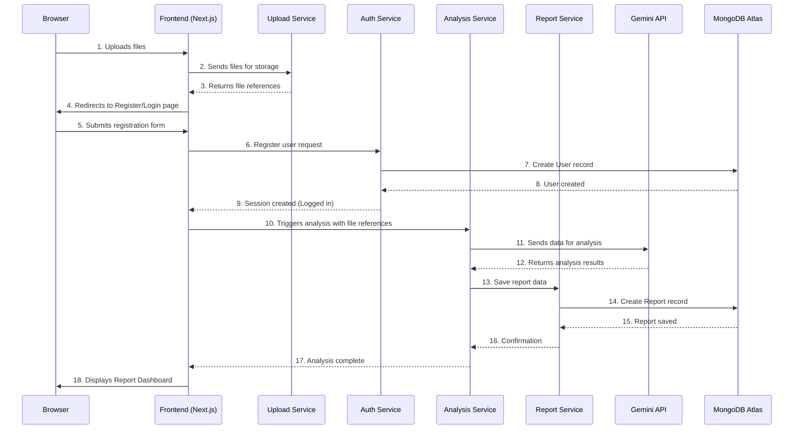
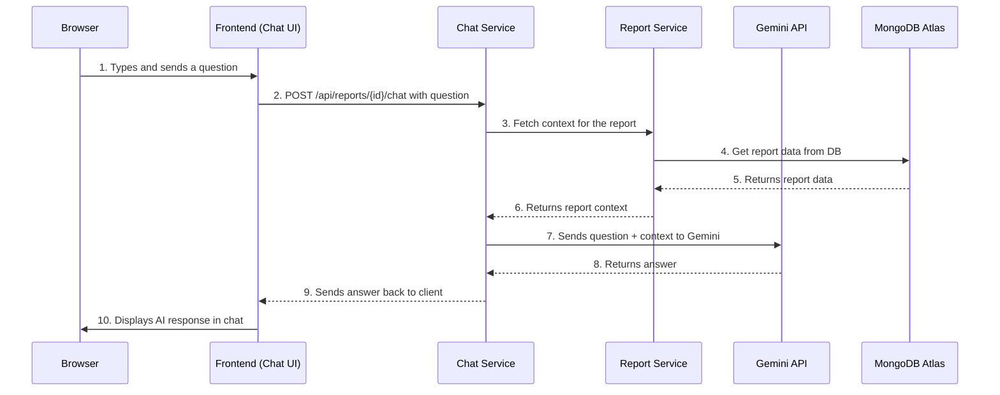

# Core Workflows

This section uses sequence diagrams to illustrate the flow of information through our system for critical user journeys.

## Workflow 1: New User's First Analysis

This diagram shows the end-to-end process from a new user uploading a file to seeing their first analysis report.

## Workflow 2: Asking a Question to the AI Co-Pilot

This diagram illustrates how a user interacts with the chat feature on an existing report.

-----

These diagrams clarify the dynamic interactions within our architecture.
