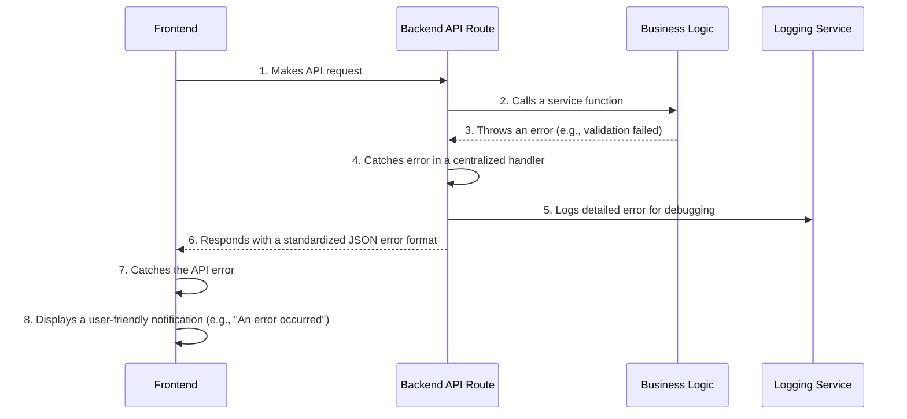

# Error Handling Strategy

A robust **Error Handling Strategy** is essential for creating a reliable application and a good user experience. This section defines how we will consistently manage and respond to errors across the full stack.

## Error Flow

This diagram illustrates how a typical error is handled, from the backend to the user.



## Error Response Format

[cite_start]All API errors will conform to this standardized TypeScript interface to ensure predictable error handling on the frontend. [cite: 999]

```typescript
interface ApiError {
  error: {
    code: string; // A unique, machine-readable error code (e.g., "validation_error")
    message: string; // A human-readable message for the error
    details?: Record<string, any>; // Optional structured data about the error
    timestamp: string; // ISO 8601 timestamp of when the error occurred
    requestId: string; // A unique ID to correlate logs
  };
}
```

## Frontend Error Handling

On the frontend, all API calls will be wrapped in a `try...catch` block to handle potential failures and display user-friendly feedback using a toast notification library.

```typescript
import apiClient from '@/lib/apiClient';
import { toast } from 'react-hot-toast';

async function handleSomeAction() {
  try {
    const data = await apiClient.post('/reports', { ... });
    toast.success('Analysis started!');
  } catch (error) {
    // The error will be in our standard ApiError format
    console.error(error); 
    toast.error('Failed to start analysis. Please try again.');
  }
}
```

## Backend Error Handling

On the backend, a middleware or a utility function will be used in each API route to catch, log, and format errors consistently.

```typescript
// Example of a catch block in an API Route
// ...
} catch (error) {
  console.error('[API_ERROR]', { 
    // structured logging
    error: error.message, 
    timestamp: new Date().toISOString() 
  });

  const apiErrorResponse = {
    error: {
      code: 'internal_server_error',
      message: 'An unexpected error occurred.',
      timestamp: new Date().toISOString(),
      requestId: 'some-unique-id',
    },
  };
  return NextResponse.json(apiErrorResponse, { status: 500 });
}
```

-----

This unified strategy ensures that we handle errors gracefully and consistently.
