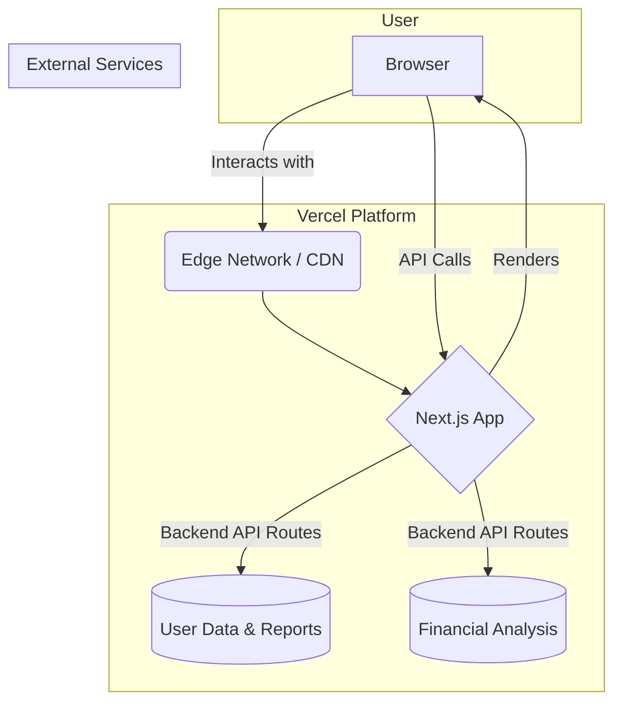

# High Level Architecture

## Technical Summary

This project will be a serverless, full-stack application built with **Next.js** and deployed on the **Vercel** platform. The system features a modern React frontend and a backend composed of serverless API routes, which will handle user authentication, data storage in **MongoDB Atlas**, and integration with the **Gemini AI model** for core analysis. This architecture is designed for high performance, automatic scalability, and a streamlined developer experience, directly supporting the PRD's goals of creating a responsive and powerful user-facing tool.

## Platform and Infrastructure Choice

  * **Platform:** **Vercel**. This is the native platform for Next.js, providing an optimized, all-in-one solution for build, deployment, and hosting.
  * **Key Services:**
      * **Vercel:** Hosting, Edge CDN, and Serverless Functions for the backend API.
      * **MongoDB Atlas:** Our primary database-as-a-service for storing user data and analysis history.
      * **Google Cloud:** To host and interact with the Gemini AI model.
  * **Deployment Host and Regions:** Managed by Vercel's global edge network to ensure low latency for users worldwide.

## Repository Structure

  * **Structure:** **Monorepo**. This was determined in the PRD.
  * **Monorepo Tool:** **Turborepo**. We will use Turborepo to manage the monorepo. It provides intelligent build caching and task orchestration, which is highly optimized for Vercel deployments and significantly speeds up build times.
  * **Package Organization:** We will use a standard `apps` and `packages` structure to separate the main web application from shared code (e.g., UI components, configs).

## High Level Architecture Diagram

## Architectural Patterns

  * **Serverless Architecture:** We will use Vercel Functions for all backend logic.
      * *Rationale:* This eliminates server management, scales automatically, and is the most cost-effective and performant approach for the Vercel platform.
  * **Component-Based UI:** The frontend will be built as a collection of reusable React components.
      * *Rationale:* This is the standard for modern web development, promoting maintainability, reusability, and testability.
  * **API Gateway (Implicit):** The Next.js API routes will serve as a single, unified gateway for all frontend requests to the backend.
      * *Rationale:* This simplifies the frontend code, centralizes backend concerns like authentication and data fetching, and provides a clear contract between the client and server.
  * **Repository Pattern (Backend):** We will use the repository pattern to abstract all database operations. Business logic will not interact directly with the MongoDB driver.
      * *Rationale:* This decouples our business logic from the database, which makes the code significantly easier to test, maintain, and potentially migrate in the future.

Excellent. Let's proceed.

We will now define the definitive **Tech Stack** for the project. This table is the single source of truth for all technologies, libraries, and tools to be used by the development team. All choices are based on our previous discussions and are optimized for our chosen full-stack, serverless architecture on Vercel.

***
