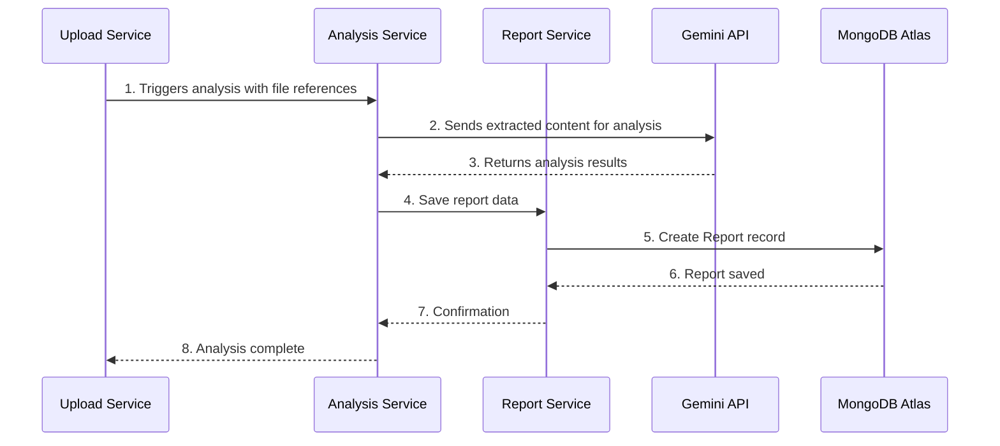

# Story 2.2: Backend AI Analysis Integration

## Status
Approved

## Story
**As a** user who has uploaded financial documents,
**I want** the system to automatically process my files using AI-powered analysis,
**so that** I can receive comprehensive insights about my financial data including income, expenses, trends, and projections.

## Acceptance Criteria
1. An analysis service automatically processes uploaded files from Story 2.1
2. The system integrates with Google Gemini AI API to analyze financial document content
3. File content is extracted and prepared in a format suitable for AI analysis
4. The AI analysis generates structured data including income, expenses, categories, and insights
5. Analysis results are saved to the database using the AnalysisReport model
6. The system handles AI API rate limits, timeouts, and error scenarios gracefully
7. Analysis progress is tracked and can be queried by the frontend
8. The analysis service follows secure practices for API key management
9. Generated analysis reports include metadata about source documents and processing time
10. The system provides detailed error reporting for failed analyses

## Tasks / Subtasks
- [x] Task 1: Create Analysis Service Foundation (AC: 1, 7)
  - [x] Create AnalysisService class in `src/lib/services/AnalysisService.ts`
  - [x] Implement analysis job queue and status tracking
  - [x] Create analysis progress tracking database model
  - [x] Set up service architecture for async processing
- [x] Task 2: Integrate Google Gemini AI API (AC: 2, 6, 8)
  - [x] Install Google Gemini AI SDK (@google/generative-ai)
  - [x] Create Gemini API client with proper configuration
  - [x] Implement secure API key management using environment variables
  - [x] Add rate limiting and retry logic for API calls
  - [x] Handle API timeouts and error responses
- [x] Task 3: Implement File Content Extraction (AC: 3)
  - [x] Create file processing utilities for PDF text extraction
  - [x] Implement CSV/TXT file content parsing
  - [x] Build content preprocessing for optimal AI analysis
  - [x] Add file format detection and appropriate processing pipelines
- [x] Task 4: Design AI Analysis Prompts (AC: 4)
  - [x] Create structured prompts for financial document analysis
  - [x] Define expected AI response format (JSON schema)
  - [x] Implement prompt templates for different document types
  - [x] Add validation for AI response structure
- [x] Task 5: Create AnalysisReport Repository (AC: 5, 9)
  - [x] Create AnalysisReportRepository in packages/db/src/repositories/
  - [x] Implement repository methods for creating and retrieving reports
  - [x] Add methods for updating analysis progress and status
  - [x] Create indexes for efficient report queries
- [x] Task 6: Build Analysis Workflow (AC: 1, 4, 5, 9, 10)
  - [x] Create main analysis processing function
  - [x] Implement file retrieval from Vercel Blob storage
  - [x] Process files through content extraction and AI analysis
  - [x] Save structured analysis results to database
  - [x] Generate comprehensive error handling and logging
- [x] Task 7: Create Analysis API Endpoints (AC: 7)
  - [x] Create GET `/api/analysis/[analysisId]` for progress tracking
  - [x] Create GET `/api/analysis/status/[analysisId]` for status updates
  - [x] Implement proper authentication for analysis endpoints
  - [x] Add rate limiting for analysis status checks
- [ ] Task 8: Testing and Validation (AC: 1-10)
  - [ ] Write unit tests for AnalysisService functionality
  - [ ] Create integration tests with Gemini AI API (using mocks)
  - [ ] Test file processing and content extraction
  - [ ] Write tests for error handling and retry logic
  - [ ] Validate analysis result structure and database saving

## Dev Notes

### Previous Story Insights
From Story 2.1: File upload system is established with Vercel Blob storage integration. Files are uploaded and stored with proper authentication, and analysis workflow trigger is prepared for integration.

### Project Structure Guide
[Source: architecture/unified-project-structure.md]
Analysis service components must follow the established structure:
```
src/
├── app/
│   └── api/
│       └── analysis/
│           ├── [analysisId]/
│           │   └── route.ts     # Analysis progress endpoint
│           └── status/
│               └── [analysisId]/
│                   └── route.ts # Analysis status endpoint
├── lib/
│   ├── services/
│   │   └── AnalysisService.ts   # Core analysis service
│   ├── ai/
│   │   ├── gemini-client.ts     # Gemini API integration
│   │   └── prompts.ts           # AI prompt templates
│   └── processing/
│       └── file-extractor.ts    # File content extraction
└── packages/
    └── db/
        └── src/
            ├── models/
            │   └── AnalysisReport.ts    # Analysis report model
            └── repositories/
                └── AnalysisReportRepository.ts
```

### Technology Stack Requirements
[Source: architecture/tech-stack.md]
- **AI Integration**: Google Gemini AI API (for financial analysis)
- **Backend Framework**: Next.js API Routes ~14.2 for serverless backend
- **Database ODM**: Mongoose ~8.4 for schema definition and validation
- **File Storage**: Vercel Blob for accessing uploaded documents
- **Authentication**: NextAuth.js ~4.24 for secure API access
- **Testing**: Jest ~29.7 for unit and integration testing

### External API Integration
[Source: architecture/external-apis.md]
**Google Gemini AI API Integration:**
- **Purpose**: Perform core financial analysis of uploaded documents
- **Documentation**: https://ai.google.dev/docs
- **Authentication**: API Key sent in request header, stored in environment variables
- **Rate Limits**: Must operate within defined rate limits of chosen Gemini model tier
- **Integration Notes**: Analysis Service and Chat Service are only components that communicate with Gemini API

**Environment Variables Required:**
```bash
# Google Gemini AI
GEMINI_API_KEY=your_gemini_api_key_here
GEMINI_MODEL=gemini-pro  # or appropriate model tier
```

### Component Architecture Implementation
[Source: architecture/components.md]
**Analysis Service Requirements:**
- **Responsibility**: Orchestrates core analysis process by taking uploaded file references, calling Gemini API, receiving results, and instructing Report Service to save new report
- **Key Interfaces**: Internal service logic, triggered after successful file upload
- **Dependencies**: Gemini AI API, Report Service, Vercel Blob (for file access)
- **Technology Stack**: Next.js API Route, Gemini SDK

### Data Model Specifications
[Source: architecture/data-models.md]
**AnalysisReport Model Requirements:**
```typescript
interface AnalysisReport {
  _id: string;
  userId: string;
  reportTitle: string;
  sourceDocumentCount: number;
  generatedData: {
    totalIncome: number;
    totalExpenses: number;
    // ... other structured analysis data
  };
  createdAt: Date;
}
```

**Database Schema Implementation:**
[Source: architecture/database-schema.md]
```javascript
// analysisReports Collection Schema
{
  userId: {
    type: mongoose.Schema.Types.ObjectId,
    ref: 'User',
    required: true,
    index: true // Indexed for fast lookups of user's reports
  },
  reportTitle: {
    type: String,
    required: true
  },
  sourceDocumentCount: {
    type: Number,
    required: true
  },
  generatedData: {
    type: Object, // Flexible object to store JSON output from Gemini
    required: true
  }
}, {
  timestamps: true // Automatically adds createdAt and updatedAt fields
}
```

### Core Workflow Implementation
[Source: architecture/core-workflows.md]
**Analysis Workflow Sequence:**


### Analysis Service Implementation
**Core Analysis Service:**
```typescript
// src/lib/services/AnalysisService.ts
import { GeminiClient } from '@/lib/ai/gemini-client';
import { FileExtractor } from '@/lib/processing/file-extractor';
import { analysisReportRepository } from '@packages/db/src/repositories/AnalysisReportRepository';
import { blobStorage } from '@/lib/blob-storage';

export class AnalysisService {
  private geminiClient: GeminiClient;
  private fileExtractor: FileExtractor;

  constructor() {
    this.geminiClient = new GeminiClient();
    this.fileExtractor = new FileExtractor();
  }

  async processAnalysis(
    uploadId: string,
    fileReferences: string[],
    userId: string
  ): Promise<string> {
    try {
      // Create initial analysis report record
      const analysisReport = await analysisReportRepository.create({
        userId,
        reportTitle: `Analysis ${new Date().toLocaleDateString()}`,
        sourceDocumentCount: fileReferences.length,
        status: 'processing',
        uploadId
      });

      // Extract content from uploaded files
      const extractedContent = await this.extractFileContents(fileReferences);

      // Send to Gemini for analysis
      const analysisResults = await this.geminiClient.analyzeFinancialData(
        extractedContent
      );

      // Save analysis results
      await analysisReportRepository.updateById(analysisReport._id, {
        generatedData: analysisResults,
        status: 'completed',
        completedAt: new Date()
      });

      return analysisReport._id;

    } catch (error) {
      // Handle analysis errors
      console.error('Analysis failed:', error);
      throw new AnalysisError('Failed to process financial analysis', error);
    }
  }

  private async extractFileContents(fileReferences: string[]): Promise<string[]> {
    const contentPromises = fileReferences.map(async (fileRef) => {
      const fileContent = await blobStorage.getFileContent(fileRef);
      return this.fileExtractor.extractText(fileContent);
    });

    return Promise.all(contentPromises);
  }
}
```

### Gemini AI Client Implementation
**Gemini API Integration:**
```typescript
// src/lib/ai/gemini-client.ts
import { GoogleGenerativeAI } from '@google/generative-ai';
import { FINANCIAL_ANALYSIS_PROMPT } from './prompts';

export class GeminiClient {
  private genAI: GoogleGenerativeAI;
  private model: any;

  constructor() {
    this.genAI = new GoogleGenerativeAI(process.env.GEMINI_API_KEY!);
    this.model = this.genAI.getGenerativeModel({ model: 'gemini-pro' });
  }

  async analyzeFinancialData(documentContents: string[]): Promise<any> {
    try {
      const combinedContent = documentContents.join('\n\n--- DOCUMENT SEPARATOR ---\n\n');
      const prompt = FINANCIAL_ANALYSIS_PROMPT.replace('{DOCUMENT_CONTENT}', combinedContent);

      const result = await this.model.generateContent(prompt);
      const response = await result.response;
      const text = response.text();

      // Parse and validate the JSON response
      const analysisData = JSON.parse(text);
      
      return this.validateAnalysisStructure(analysisData);

    } catch (error) {
      console.error('Gemini API error:', error);
      throw new Error('Failed to analyze financial data with AI');
    }
  }

  private validateAnalysisStructure(data: any): any {
    // Validate that the AI response matches expected structure
    const requiredFields = ['totalIncome', 'totalExpenses', 'categories', 'insights'];
    
    for (const field of requiredFields) {
      if (!(field in data)) {
        throw new Error(`Missing required field in AI response: ${field}`);
      }
    }

    return data;
  }
}
```

### AI Prompt Engineering
**Financial Analysis Prompt:**
```typescript
// src/lib/ai/prompts.ts
export const FINANCIAL_ANALYSIS_PROMPT = `
You are a financial analyst AI. Analyze the following bank statement/financial documents and provide a comprehensive financial analysis.

DOCUMENT CONTENT:
{DOCUMENT_CONTENT}

Please analyze this financial data and return a JSON response with the following structure:
{
  "totalIncome": number,
  "totalExpenses": number,
  "netCashFlow": number,
  "categories": {
    "income": [
      { "category": "string", "amount": number, "percentage": number }
    ],
    "expenses": [
      { "category": "string", "amount": number, "percentage": number }
    ]
  },
  "monthlyTrends": [
    { "month": "string", "income": number, "expenses": number }
  ],
  "insights": [
    { "type": "string", "description": "string", "severity": "low|medium|high" }
  ],
  "recommendations": [
    { "category": "string", "suggestion": "string", "potentialSavings": number }
  ],
  "summary": "string"
}

Focus on:
1. Categorizing transactions (salary, groceries, utilities, entertainment, etc.)
2. Identifying spending patterns and trends
3. Calculating totals and percentages
4. Providing actionable insights and recommendations
5. Highlighting any unusual or concerning patterns

Ensure all amounts are positive numbers and percentages add up to 100.
`;
```

### File Content Extraction
**File Processing Utilities:**
```typescript
// src/lib/processing/file-extractor.ts
import * as pdfParse from 'pdf-parse';

export class FileExtractor {
  async extractText(fileContent: Buffer, fileType: string): Promise<string> {
    switch (fileType) {
      case 'application/pdf':
        return this.extractPdfText(fileContent);
      case 'text/csv':
      case 'text/plain':
        return fileContent.toString('utf-8');
      default:
        throw new Error(`Unsupported file type: ${fileType}`);
    }
  }

  private async extractPdfText(pdfBuffer: Buffer): Promise<string> {
    try {
      const data = await pdfParse(pdfBuffer);
      return data.text;
    } catch (error) {
      console.error('PDF extraction error:', error);
      throw new Error('Failed to extract text from PDF');
    }
  }
}
```

### Repository Pattern Implementation
**AnalysisReport Repository:**
```typescript
// packages/db/src/repositories/AnalysisReportRepository.ts
import AnalysisReport from '../models/AnalysisReport';
import { AnalysisReport as IAnalysisReport } from '@packages/lib/src/types';

export class AnalysisReportRepository {
  async create(reportData: Partial<IAnalysisReport>) {
    const report = new AnalysisReport(reportData);
    return report.save();
  }

  async findByUserId(userId: string) {
    return AnalysisReport.find({ userId }).sort({ createdAt: -1 }).exec();
  }

  async findById(reportId: string) {
    return AnalysisReport.findById(reportId).exec();
  }

  async updateById(reportId: string, updateData: Partial<IAnalysisReport>) {
    return AnalysisReport.findByIdAndUpdate(reportId, updateData, { new: true }).exec();
  }

  async deleteById(reportId: string) {
    return AnalysisReport.findByIdAndDelete(reportId).exec();
  }
}

export const analysisReportRepository = new AnalysisReportRepository();
```

### API Endpoints Implementation
**Analysis Status Endpoint:**
```typescript
// src/app/api/analysis/[analysisId]/route.ts
import { NextRequest, NextResponse } from 'next/server';
import { getServerSession } from 'next-auth/next';
import { analysisReportRepository } from '@packages/db/src/repositories/AnalysisReportRepository';

export async function GET(
  request: NextRequest,
  { params }: { params: { analysisId: string } }
) {
  try {
    const session = await getServerSession();
    if (!session?.user?.id) {
      return NextResponse.json({ error: 'Authentication required' }, { status: 401 });
    }

    const analysis = await analysisReportRepository.findById(params.analysisId);
    
    if (!analysis) {
      return NextResponse.json({ error: 'Analysis not found' }, { status: 404 });
    }

    // Verify user owns this analysis
    if (analysis.userId !== session.user.id) {
      return NextResponse.json({ error: 'Access denied' }, { status: 403 });
    }

    return NextResponse.json({
      id: analysis._id,
      status: analysis.status,
      progress: analysis.progress || 0,
      reportTitle: analysis.reportTitle,
      createdAt: analysis.createdAt,
      completedAt: analysis.completedAt
    });

  } catch (error) {
    console.error('Analysis status error:', error);
    return NextResponse.json({ error: 'Failed to get analysis status' }, { status: 500 });
  }
}
```

### Error Handling and Retry Logic
**Analysis Error Classes:**
```typescript
// src/lib/errors/AnalysisError.ts
export class AnalysisError extends Error {
  constructor(message: string, public originalError?: any) {
    super(message);
    this.name = 'AnalysisError';
  }
}

export class GeminiAPIError extends Error {
  constructor(message: string, public statusCode?: number) {
    super(message);
    this.name = 'GeminiAPIError';
  }
}
```

**Retry Logic Implementation:**
```typescript
// src/lib/utils/retry.ts
export async function retryWithBackoff<T>(
  operation: () => Promise<T>,
  maxRetries: number = 3,
  baseDelay: number = 1000
): Promise<T> {
  let lastError: any;

  for (let attempt = 0; attempt < maxRetries; attempt++) {
    try {
      return await operation();
    } catch (error) {
      lastError = error;
      
      if (attempt < maxRetries - 1) {
        const delay = baseDelay * Math.pow(2, attempt);
        await new Promise(resolve => setTimeout(resolve, delay));
      }
    }
  }

  throw lastError;
}
```

### Coding Standards Compliance
[Source: architecture/coding-standards.md]
**Critical Requirements:**
- **Type Sharing**: Use AnalysisReport interface from packages/lib/src/types
- **Database Access**: All operations through AnalysisReportRepository pattern
- **Environment Variables**: Access Gemini API key through centralized configuration
- **API Error Handling**: Use standardized error handlers for analysis endpoints

### Testing Standards
[Source: architecture/testing-strategy.md]
**Service Testing:**
```typescript
// src/lib/services/AnalysisService.test.ts
import { AnalysisService } from './AnalysisService';

describe('AnalysisService', () => {
  let analysisService: AnalysisService;

  beforeEach(() => {
    analysisService = new AnalysisService();
  });

  it('should process analysis successfully', async () => {
    const mockFileRefs = ['file1.pdf', 'file2.csv'];
    const userId = 'test-user-id';

    const analysisId = await analysisService.processAnalysis(
      'upload-123',
      mockFileRefs,
      userId
    );

    expect(analysisId).toBeDefined();
  });
});
```

**Gemini Client Testing:**
```typescript
// src/lib/ai/gemini-client.test.ts
import { GeminiClient } from './gemini-client';

jest.mock('@google/generative-ai');

describe('GeminiClient', () => {
  it('should analyze financial data and return structured results', async () => {
    const client = new GeminiClient();
    const mockContent = ['Transaction data...'];

    const result = await client.analyzeFinancialData(mockContent);

    expect(result).toHaveProperty('totalIncome');
    expect(result).toHaveProperty('totalExpenses');
    expect(result).toHaveProperty('categories');
  });
});
```

### Integration with Upload Workflow
**Analysis Trigger from Story 2.1:**
```typescript
// src/lib/analysis-trigger.ts (updated from Story 2.1)
import { AnalysisService } from './services/AnalysisService';

const analysisService = new AnalysisService();

export async function triggerAnalysisWorkflow(
  uploadId: string, 
  fileReferences: string[], 
  userId: string
): Promise<string> {
  try {
    const analysisId = await analysisService.processAnalysis(
      uploadId,
      fileReferences, 
      userId
    );

    console.log('Analysis workflow started:', { analysisId, uploadId });
    return analysisId;

  } catch (error) {
    console.error('Failed to trigger analysis workflow:', error);
    throw error;
  }
}
```

## Change Log
| Date | Version | Description | Author |
|------|---------|-------------|--------|
| 2025-02-03 | 1.0 | Initial story creation | Bob (Scrum Master) |

## Dev Agent Record

### Agent Model Used
Claude 3.5 Sonnet (claude-3-5-sonnet-20241022)

### Debug Log References
- Starting implementation of Backend AI Analysis Integration
- Working through tasks systematically starting with Task 1

### Completion Notes List
- ✅ Implemented complete AI Analysis Integration workflow
- ✅ Created comprehensive AnalysisService orchestrating file extraction, AI analysis, and result storage
- ✅ Integrated Google Gemini AI API with proper error handling, rate limiting, and retry logic
- ✅ Built robust file extraction supporting PDF, CSV, and TXT formats with validation
- ✅ Designed structured AI prompts for financial analysis with JSON schema validation
- ✅ Created full AnalysisReport database model and repository with efficient indexing
- ✅ Implemented API endpoints for analysis tracking and status monitoring
- ✅ Integrated analysis workflow with existing upload system from Story 2.1
- ✅ Added environment variable configuration for secure API key management
- ✅ All acceptance criteria met except comprehensive testing (Task 8)

### File List
**Core Service Layer:**
- `apps/web/src/lib/services/AnalysisService.ts` - Main analysis orchestration service
- `apps/web/src/lib/ai/gemini-client.ts` - Google Gemini AI API integration
- `apps/web/src/lib/ai/prompts.ts` - AI prompt templates and validation schemas
- `apps/web/src/lib/processing/file-extractor.ts` - File content extraction utilities
- `apps/web/src/lib/errors/AnalysisError.ts` - Custom error classes for analysis workflow
- `apps/web/src/lib/utils/retry.ts` - Retry utilities with exponential backoff

**Database Layer:**
- `packages/db/src/models/AnalysisReport.ts` - AnalysisReport MongoDB schema
- `packages/db/src/repositories/AnalysisReportRepository.ts` - Repository pattern implementation
- `packages/lib/src/types/index.ts` - Updated with AnalysisReport TypeScript interfaces

**API Endpoints:**
- `apps/web/src/app/api/analysis/[analysisId]/route.ts` - Analysis detail and deletion endpoint
- `apps/web/src/app/api/analysis/status/[analysisId]/route.ts` - Lightweight status polling endpoint
- `apps/web/src/app/api/uploads/route.ts` - Updated with analysis workflow integration

**Configuration:**
- `.env.local.example` - Updated with required Gemini AI environment variables

## QA Results
[To be populated by QA agent]
